# Overview

This repository is for the kidnapped vehicle project, which is a part of the Localization course in Udacity's Self-Driving Car Nanodegree. The original repo can be found at [here]( https://github.com/udacity/CarND-Kidnapped-Vehicle-Project).

This README.md also based on the original [README.md]( https://github.com/udacity/CarND-Kidnapped-Vehicle-Project/README.md).

<br/><br/>

## Project Introduction

Your robot has been kidnapped and transported to a new location! Luckily it has a map of this location, a (noisy) GPS estimate of its initial location, and lots of (noisy) sensor and control data.

This project presents a 2 dimensional particle filter in C++. The particle filter uses a map and some initial localization information (analogous to what a GPS would provide). At each time step the filter will also get observation and control data.

<br/><br/>

## Running the Code

This repository includes two files that can be used to set up and install uWebSocketIO for either Linux or Mac systems. For windows you can use either Docker, VMware, or even Windows 10 Bash on Ubuntu to install uWebSocketIO.

Once the install for uWebSocketIO is complete, the main program can be built and ran by doing the following from the project top directory.

1. mkdir build
2. cd build
3. cmake ..
4. make
5. ./particle_filter

<br/><br/>

Alternatively some scripts have been included to streamline this process, these can be leveraged by executing the following in the top directory of the project:

1. ./clean.sh
2. ./build.sh
3. ./run.sh

<br/><br/>

Tips for setting up your environment can be found [here](https://classroom.udacity.com/nanodegrees/nd013/parts/40f38239-66b6-46ec-ae68-03afd8a601c8/modules/0949fca6-b379-42af-a919-ee50aa304e6a/lessons/f758c44c-5e40-4e01-93b5-1a82aa4e044f/concepts/23d376c7-0195-4276-bdf0-e02f1f3c665d). The program main.cpp has already been filled out, and It uses for uWebSocketIO in communicating with the simulator.

INPUT: values provided by the simulator to the c++ program

// sense noisy position data from the simulator

["sense_x"]

["sense_y"]

["sense_theta"]

// get the previous velocity and yaw rate to predict the particle's transitioned state

["previous_velocity"]

["previous_yawrate"]

// receive noisy observation data from the simulator, in a respective list of x/y values

["sense_observations_x"]

["sense_observations_y"]


OUTPUT: values provided by the c++ program to the simulator

// best particle values used for calculating the error evaluation

["best_particle_x"]

["best_particle_y"]

["best_particle_theta"]

//Optional message data used for debugging particle's sensing and associations

// for respective (x,y) sensed positions ID label

["best_particle_associations"]

// for respective (x,y) sensed positions

["best_particle_sense_x"] <= list of sensed x positions

["best_particle_sense_y"] <= list of sensed y positions

<br/><br/>

# Implementing the Particle Filter

The directory structure of this repository is as follows:

```
root
|   build.sh
|   clean.sh
|   CMakeLists.txt
|   README.md
|   run.sh
|
|___data
|   |   
|   |   map_data.txt
|   
|   
|___src
    |   helper_functions.h
    |   main.cpp
    |   map.h
    |   particle_filter.cpp
    |   particle_filter.h
```

src/particle_filter.cpp contains the scaffolding of a `ParticleFilter` class and some associated methods, and src/main.cpp contains the code that will actually be running the particle filter and calling the associated methods.

<br/><br/>

## Inputs to the Particle Filter

The inputs to the particle filter are in the `data` directory.

#### The Map*
`map_data.txt` includes the position of landmarks (in meters) on an arbitrary Cartesian coordinate system. Each row has three columns
1. x position
2. y position
3. landmark id

### All other data the simulator provides, such as observations and controls.

> * Map data provided by 3D Mapping Solutions GmbH.

<br/><br/>

## What I've done

The basic structure was given at [here](https://github.com/udacity/CarND-Kidnapped-Vehicle-Project). In order to accomplish the project, I put some code to activate ParticleFilter::init(), ParticleFilter::prediction(), ParticleFilter::dataAssociation(), ParticleFilter::updateWeights(), and ParticleFilter::resample() in src/particle_filter.cpp. 

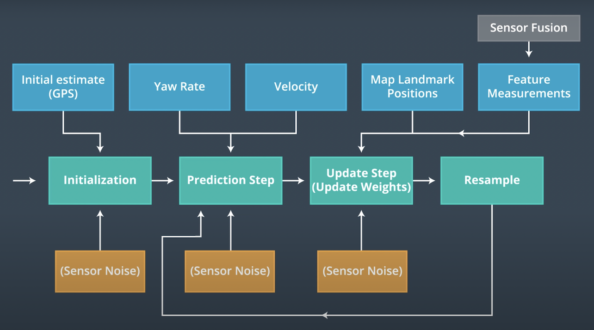

<div align="center">captured from classroom.udacity.com/nanodegrees/nd013

<div align="left">

<br/><br/>

###  ParticleFilter::init()

This function sets the number of particles and initialize all particles to their first position (based on estimates of x, y, theta and their uncertaintiesfrom GPS) and weight 1.

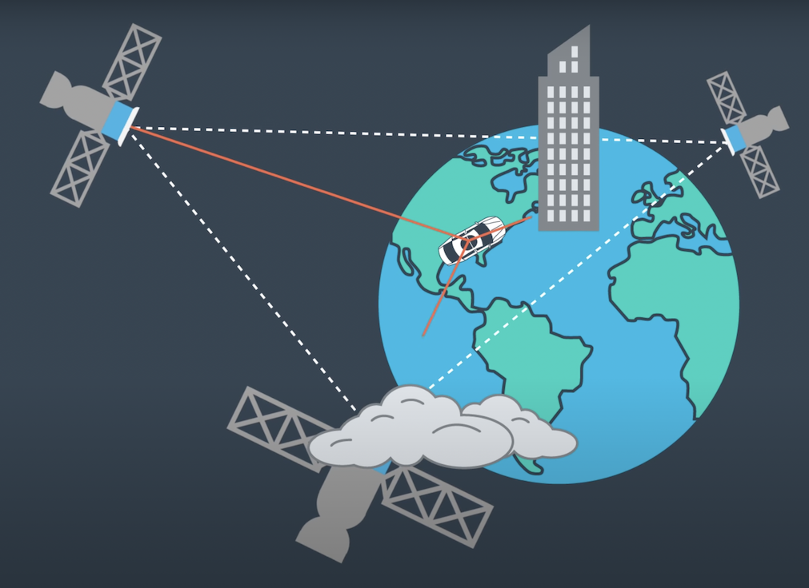

<div align="center">captured from classroom.udacity.com/nanodegrees/nd013

<div align="left">


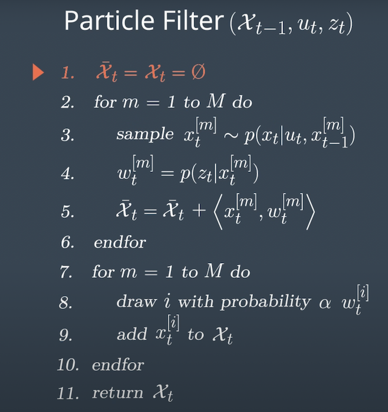

<div align="center">captured from classroom.udacity.com/nanodegrees/nd013

<div align="left">

<br/><br/>

Based on the answer in  [here](https://knowledge.udacity.com/questions/29851), 100 particles are usedYou can see there is no significant increase in the accuracy when you use more than 100 particles in the figure below.

```c++
/// Set the number of particles
num_particles = 100; 
```


<div align="center">captured from knowledge.udacity.com/questions/29851)

<div align="left">

<br/><br/>

```c++
	/// Initialize all particles to first position with weight = 1
	///     (based on estimates of x, y, theta and their uncertainties from GPS) 
	normal_distribution<double> nd_x(x, std[0]);
	normal_distribution<double> nd_y(y, std[1]);
	normal_distribution<double> nd_theta(theta, std[2]);
  
	int i = -1;
	while (++i < num_particles)
	{
		Particle sample;
  
		sample.id = i;
		/// Add random Gaussian noise to each particle
		sample.x = nd_x(gen);
		sample.y = nd_y(gen);
		sample.theta = nd_theta(gen); 
		// all weights to 1
		sample.weight = 1.0;

		particles.push_back(sample);
		weights.push_back(sample.weight);
	}
  
	is_initialized = true;
```
<br/><br/>

###  ParticleFilter::prediction()

This function adds measurements to each particle and add random Gaussian noise.


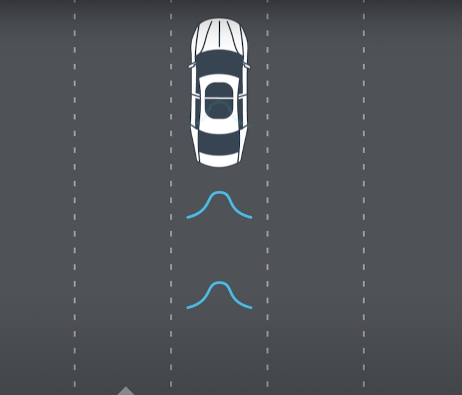

<div align="center">captured from classroom.udacity.com/nanodegrees/nd013

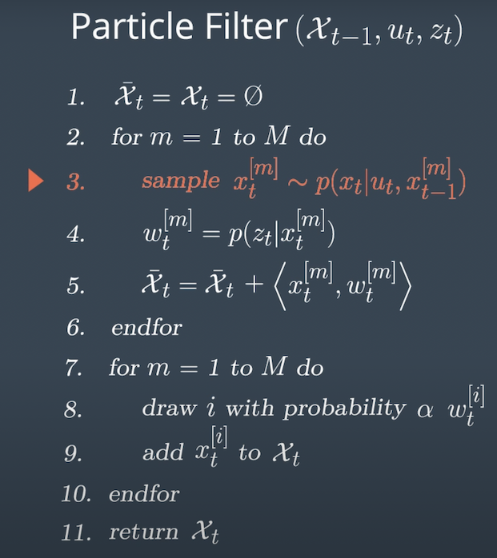

<div align="center">captured from classroom.udacity.com/nanodegrees/nd013

<div align="left">

<br/><br/>

```c++
	/// Add measurements to each particle and add random Gaussian noise   
	int i;
  	double x0, y0, theta0;
  	double x1, y1, theta1;
  
	i = -1;
  	while (++i < num_particles)
	{
		x0 = particles[i].x;
		y0 = particles[i].y;
		theta0 = particles[i].theta;

		if (fabs(yaw_rate) > 0.0001)	//theta0 != 0
		{
			theta1 = theta0 + yaw_rate * delta_t;
			x1 = x0 + (velocity / yaw_rate) * (sin(theta1) - sin(theta0));
			y1 = y0 + (velocity / yaw_rate) * (cos(theta0) - cos(theta1));
		}
		else							//theta0 = 0
		{
			theta1 = theta0;
			x1 = x0 + velocity * cos(theta0) * delta_t;
			y1 = y0 + velocity * sin(theta0) * delta_t;
		}        
      
		normal_distribution<double> nd_x(x1, std_pos[0]);
		normal_distribution<double> nd_y(y1, std_pos[1]);
		normal_distribution<double> nd_theta(theta1, std_pos[2]);  
      
		particles[i].x = nd_x(gen);
		particles[i].y = nd_y(gen);
		particles[i].theta = nd_theta(gen);     
	}  
```
<br/><br/>

###  ParticleFilter::dataAssociation()

This function is used as a part of the process in the ParticleFilter::updateWeights() function, so it is called in the updateWeights() function.

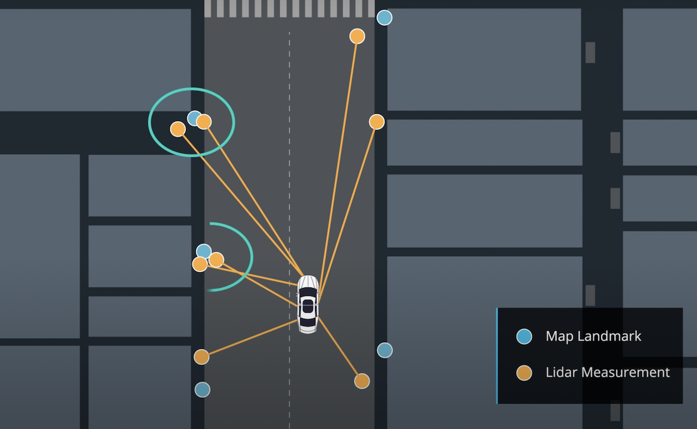

<div align="center">captured from classroom.udacity.com/nanodegrees/nd013

<div align="left">

<br/><br/>

```c++
/// Find the nearest neighbour landmark measurement of each observed measurement 
/// then pair observations[i].id and nearest_landmark_id  
double dist_ij, dist_min;
int nearest_landmark_id;
int i, j; 

i = -1;
while (++i < (int)observations.size())
{
	dist_min = std::numeric_limits<double>::max();
	nearest_landmark_id = -1;

	j = -1;
	while (++j < (int)predicted.size())
    {
		dist_ij = dist(observations[i].x, observations[i].y, predicted[j].x, predicted[j].y);
		if (dist_ij < dist_min)
		{
			dist_min = dist_ij;
			nearest_landmark_id = predicted[j].id;
		}
	}
	observations[i].id = nearest_landmark_id;
}
```
<br/><br/>

###  ParticleFilter::updateWeights()

This function updates the weights of each particle using a mult-variate Gaussian distribution. 


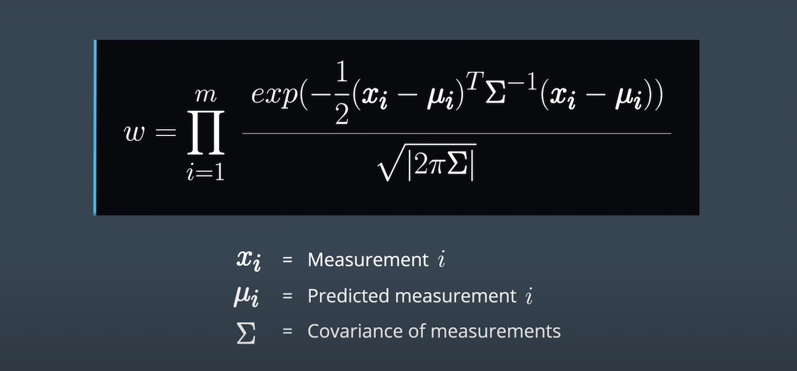

<div align="center">captured from classroom.udacity.com/nanodegrees/nd013

<div align="left">

<br/><br/>

```c++
double multiv_prob(double sig_x, double sig_y, double x_obs, double y_obs,
                   double mu_x, double mu_y) {
  // calculate normalization term
  double gauss_norm;
  gauss_norm = 1 / (2 * M_PI * sig_x * sig_y);

  // calculate exponent
  double exponent;
  exponent = (pow(x_obs - mu_x, 2) / (2 * pow(sig_x, 2)))
               + (pow(y_obs - mu_y, 2) / (2 * pow(sig_y, 2)));
    
  // calculate weight using normalization terms and exponent
  double weight;
  weight = gauss_norm * exp(-exponent);
    
  return weight;
}
```

<br/><br/>

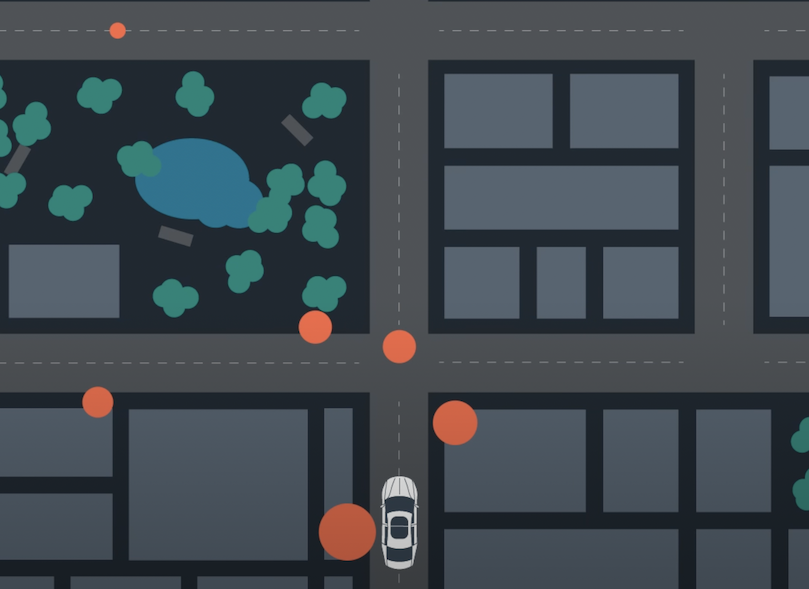

<div align="center">captured from classroom.udacity.com/nanodegrees/nd013

<div align="left">

<br/><br/>

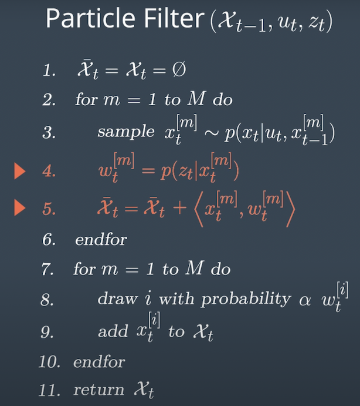

<div align="center">captured from classroom.udacity.com/nanodegrees/nd013

<div align="left">

<br/><br/>

```c++
int i, j, k;
double weight_sum = 0.0;
  
i = -1;  
while (++i < (int)particles.size())
{
	Particle &p = particles[i];
  
	// Filter map landmarks to keep only in the sensor_range of from particle p
	vector<LandmarkObs> predicted_lmobs;
	j = -1;
	while (++j < (int)map_landmarks.landmark_list.size()) 
	{
		Map::single_landmark_s lm = map_landmarks.landmark_list[j];
		if ((fabs((p.x - lm.x_f)) <= sensor_range) && (fabs((p.y - lm.y_f)) <= sensor_range)) 
		{
			LandmarkObs predicted_lmob;
			predicted_lmob.id = lm.id_i;
			predicted_lmob.x = lm.x_f;
			predicted_lmob.y = lm.y_f;              
			predicted_lmobs.push_back(predicted_lmob);
		}
	}
  
	// Transform obs from vehicle coords to map coords
	vector<LandmarkObs> trans_obs;
	j = -1;
	while (++j < (int)observations.size()) 
	{
		LandmarkObs ob = observations[j];
      	LandmarkObs trans_ob;
		trans_ob.id = j;
		trans_ob.x = p.x + (cos(p.theta) * ob.x) - (sin(p.theta) * ob.y);
		trans_ob.y = p.y + (sin(p.theta) * ob.x) + (cos(p.theta) * ob.y);
		trans_obs.push_back(trans_ob);
	}
  
	// Associate observations with predicted landmarks using nearest neighbor algorithm
	dataAssociation(predicted_lmobs, trans_obs);
  
	// Calculate the weight of each particle using Multivariate Gaussian distribution.
	p.weight = 1.0;
	j = -1;
	while (++j < (int)trans_obs.size())
	{
		LandmarkObs	&t_ob = trans_obs[j];
		k = -1;
		while (++k < (int)predicted_lmobs.size())
        {
			LandmarkObs &p_lmob = predicted_lmobs[k];
			if (t_ob.id == p_lmob.id)
				p.weight *= multiv_prob(std_landmark[0], std_landmark[1], 
                                		t_ob.x, t_ob.y, p_lmob.x, p_lmob.y); 
		}   
    }  
  
	weight_sum += p.weight;
//eoWhile(p)  
}
  
// Normalize the weights of all particles; weight /= weight_sum
i = -1;
while (++i < (int)particles.size()) 
{
	particles[i].weight /= weight_sum;
	weights[i] = particles[i].weight;
}  
```
<br/><br/>

###  ParticleFilter::resample()

This function resamples particles based on probability proportional to their weight. 

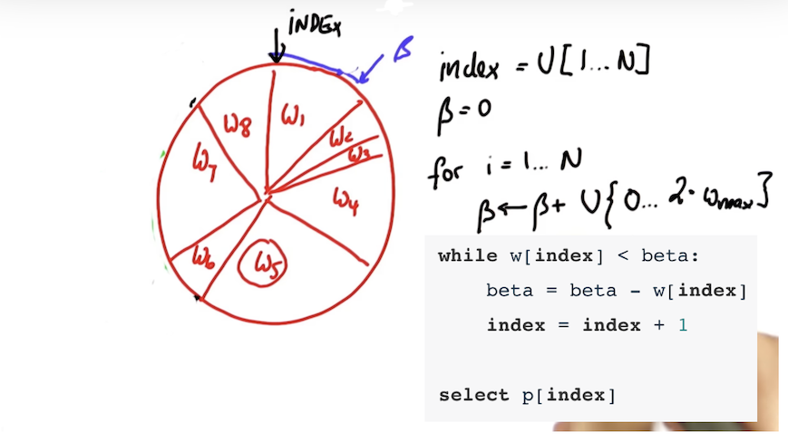

<div align="center">captured from classroom.udacity.com/nanodegrees/nd013

<div align="left">

<br/><br/>

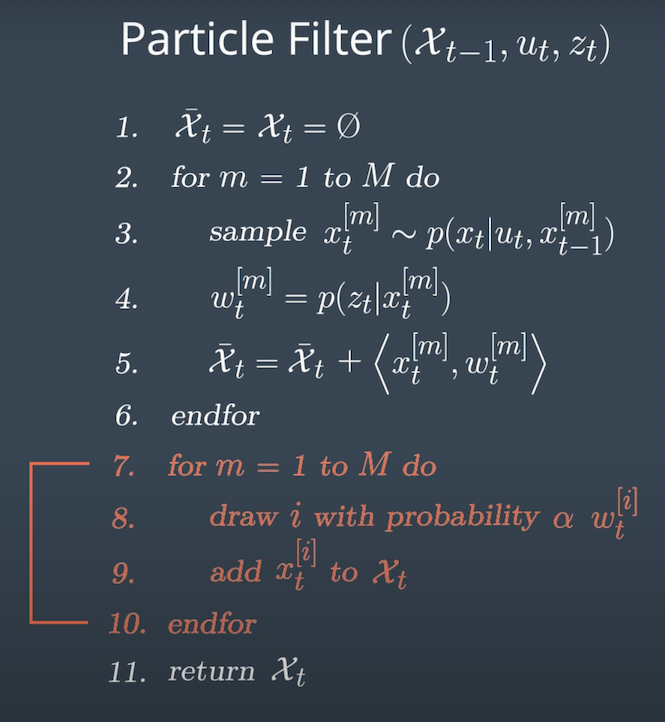

<div align="center">captured from classroom.udacity.com/nanodegrees/nd013

<div align="left">

<br/><br/>

```c++
/// Resample particles with replacement with probability proportional to their weight
vector<Particle> new_particles;
uniform_int_distribution<int> ud_p_idx(0, num_particles - 1);  
int p_index = ud_p_idx(gen);
double beta = 0.0;
double max_weight = *max_element(weights.begin(), weights.end());
int i;  
  
i = -1;
while (++i < (int)particles.size()) 
{
	uniform_real_distribution<double> random_weight(0.0, max_weight * 2.0);
	beta += random_weight(gen);

 	while (weights[p_index] < beta) 
	{
		beta -= weights[p_index];
		p_index = (p_index + 1) % num_particles;
	}
	new_particles.push_back(particles[p_index]);
}

particles = new_particles;
```
<br/><br/>

## Success Criteria

The particle filter has passed the current grading code in the simulator as you can see in the figure below.

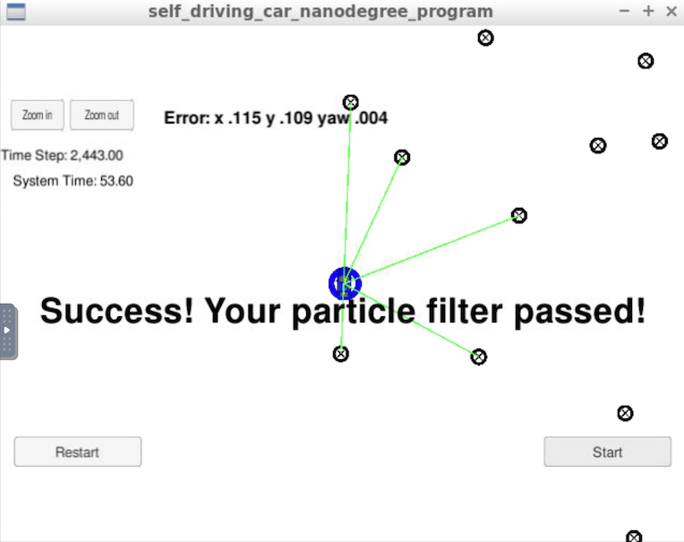

<div align="center">captured from udacity carnd simulator

<div align="left">

<br/><br/>

The things the grading code is looking for are:


1. **Accuracy**: This criteria is checked automatically when you do ./run.sh in the terminal. If the output says "Success! Your particle filter passed!" then it means you’ve met this criteria.

2. **Performance**: This criteria is checked automatically when you do ./run.sh in the terminal. If the output says "Success! Your particle filter passed!" then it means you’ve met this criteria.